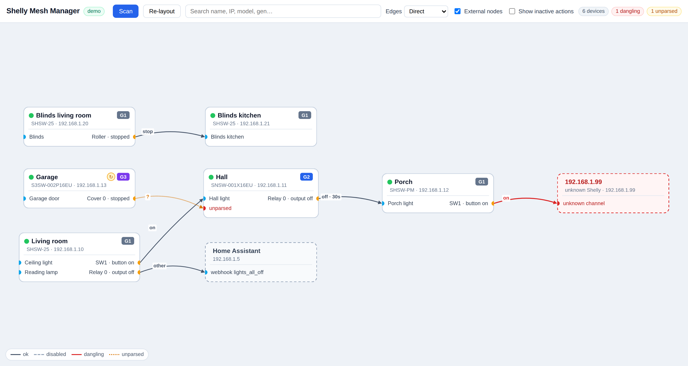

# Shelly Mesh Manager

Self-hosted web app that discovers Shelly devices on your LAN and visualizes the
automation mesh their HTTP action URLs create, as an interactive graph.

**Phase 1 (this release) is read-only:** discovery, inventory, graph. No writes
are ever sent to a device. Editing arrives in Phase 2 (see `docs/SPEC.md`).



## Quick start

```bash
make demo    # docker compose --profile demo up  → http://localhost:8099
```

Demo mode seeds a fixture network and performs **no network I/O at all**, so the
UI is verifiable even with zero devices reachable. To scan your real LAN:

```bash
make up      # docker compose up
```

Then open `http://<docker-host>:8099`.

| target | what it does |
|---|---|
| `make dev` | backend on `:8099` with `DEMO_MODE=true`, Vite dev server on `:5173` proxying `/api` |
| `make build` | `docker compose build` |
| `make demo` | `docker compose --profile demo up` (`DEMO_MODE=true`) |
| `make up` | `docker compose up` (real scan) |
| `make test` | backend pytest suite + frontend typecheck |

`make dev` needs Python 3.12 and Node 20+; it creates `backend/.venv` and installs
`frontend/node_modules` on first run.

## Configuration (environment variables only)

| Var | Default | Purpose |
|---|---|---|
| `PORT` | `8099` | HTTP port |
| `SCAN_SUBNET` | *(empty)* | CIDR for the range-scan fallback, e.g. `192.168.1.0/24` |
| `SCAN_INTERVAL_MIN` | `15` | periodic re-scan in minutes; `0` disables |
| `DEMO_MODE` | `false` | serve the fixture network, no network I/O |
| `HTTP_TIMEOUT_S` | `3` | per-device request timeout |

`DATA_DIR` (default `/data`) additionally exists as a development convenience so
`make dev` can keep its database in `./data`; in the container it stays `/data`.

## Networking: mDNS vs. range scan

`docker-compose.yml` runs the live service with `network_mode: host` because mDNS
(`_http._tcp.local.` / `_shelly._tcp.local.`) does not cross Docker's bridge
network.

**If host networking is unavailable** — Docker Desktop on macOS/Windows, rootless
Docker, some NAS platforms — mDNS discovery will find nothing. In that case use
the range-scan fallback:

1. Remove `network_mode: host` from the `app` service and publish the port
   instead (`ports: ["8099:8099"]`).
2. Set `SCAN_SUBNET` to the subnet your Shellys live on, e.g.:

```yaml
environment:
  SCAN_SUBNET: "192.168.1.0/24"
```

Every address in that CIDR is probed with `GET /shelly` (16 concurrent requests,
`HTTP_TIMEOUT_S` each), which is how the app finds devices without mDNS.

## Data & security

State lives in `/data` (mounted from `./data`), a single SQLite file `mesh.db`:
inventory, action slots and URLs, derived edges, node positions, per-scan config
snapshots (last 10 per device), and device credentials.

**Device credentials are stored in plain text in `/data`.** `/data` is the trust
boundary — protect it like a password file. The UI itself has no authentication;
do not expose the port to an untrusted network.

## How the graph is built

- **Nodes** — one per discovered device; plus one external node per non-Shelly URL
  host (HA webhook hosts are labelled "Home Assistant"), plus a ghost
  "unknown Shelly" node for Shelly-looking URLs whose host is not inventoried.
- **Input ports** (left) are the device's controllable channels (relay / roller /
  cover / light / white). Always visible.
- **Output ports** (right) are action slots, labelled with their event source
  (`SW1 · button on`, `Relay 0 · output off`, `Roller · stopped`). Visible when the
  slot is enabled and has at least one URL; "Show inactive actions" reveals the
  rest, dimmed.
- **Edges** — one per action URL, labelled with the normalized command
  (`on`, `off · 30s`, `open · 50%`, `set · b=80`, `?` when unparsed) and styled by
  status: solid = ok, dashed = disabled, red = dangling, amber dotted = unparsed.
- **Edge routing** — the toolbar's *Edges* selector switches between **Direct**
  (one curve per connection, fanned apart where several leave the same port) and
  **Orthogonal** (a wiring-diagram look: every connection gets its own vertical
  channel). Both draw each connection separately; neither bundles edges into a
  shared trunk.
- **Labels** — *Always show labels* off draws a command label only while the
  pointer is on its edge (the selected edge keeps its label), which clears most
  of the clutter on a busy network.
- **Positions** — *Save positions* controls whether dragging a node writes to
  `node_layout`. On (the default) positions survive a restart; off lets you
  rearrange the canvas without committing anything.

The view toggles are remembered per browser in `localStorage`; the server keeps
only the node positions.

Full semantics: `docs/SPEC.md` §1–§3.

## API (Phase 1)

```
GET  /api/health                      → {status, version, demo}
POST /api/scan                        → {scan_id}   (409 while a scan runs)
GET  /api/scan/{id}                   → {status, found, errors[]}
GET  /api/devices                     → Device[] (channels + slots + urls nested)
GET  /api/devices/{id}                → full detail incl. raw_info
POST /api/devices/{id}/credentials    → {ok}; body {username, password}; re-probes
GET  /api/graph                       → Graph {nodes, edges}
PUT  /api/layout                      → {ok}; body [{node_id, x, y}]
```

## Repository layout

```
backend/app/   main.py, config.py, db.py, models.py,
               discovery/ (mdns.py, range_scan.py), adapters/ (base.py, gen1.py, gen2.py),
               resolver.py, graph.py, api.py, demo_fixtures.py
frontend/src/  api.ts, graph/ (GraphView.tsx, nodeRenderer.ts, styles.ts),
               components/ (DeviceDrawer.tsx, EdgePopover.tsx, Toolbar.tsx)
Dockerfile · docker-compose.yml · Makefile · README.md
```
